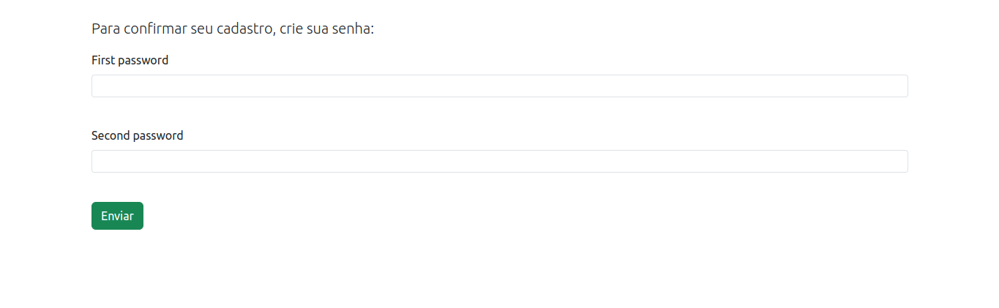

# BRA Back
### Backend das aplicações desktop e mobile do projeto de BRA Premens, uma prensa eletromecânica semi-automática monitorada em tempo real.

O projeto BRA Back, atualmente, conta com uma API para a aplicação desktop voltada para empresas, que conta com endpoints para cadastro de novos clientes, alteração de CEP e resgate de clientes cadastrados.

[Clique aqui](https://github.com/weblerson/bra-desktop) para acessar o repositório da aplicação desktop, que está em processo de desenvolvimento.

## Tecnologias Utilizadas:
- Python
- Django
- Django Ninja
- Redis
- MySQL
- Postgres
- Celery
- Docker
- Git

## Como Usar a API:

Por se tratar de uma API de uso exclusivo da aplicação desktop, foi decidido que seria feita a troca de informações por um token JWT, carregando as informações principais.

### Cadastro de Novos Clientes:
##### Endpoint: /api/v1/users
##### Método: POST
##### Body: Token JWT

Para realizar o cadastro de um cliente, é necessário enviar no corpo da requisição um token JWT contendo o nome completo do cliente, o CPF, CEP, e-mail e o cargo.

```json
{
    "token": "token_jwt"
}
```

Como a  aplicação desktop está sendo desenvolvida com Java 17, então temos como exemplo de uma requisição o seguinte método:

```java
import java.net.URI;
import java.net.http.HttpClient;
import java.net.http.HttpRequest;
import java.net.http.HttpResponse;

public class PremensHttpRequest {

    public static void createUser(String token) {
        HttpClient client = HttpClient.newHttpClient().build();
        URI uri = URI.create("https://www.example.com/api/v1/users");

        HttpRequest request = HttpRequest.newBuilder()
            .POST(BodyPublishers.ofString(String.format("{\"token\": \"%s\"}", token)))
            .uri(uri)
            .headers("Accept", "application/json", "Content-Type", "application/json")
            .build();

        HttpResponse response = httpClient.send(request, BodyHandlers.ofString());

        System.out.println(response.body());
    }
}
```

Dessa forma, é esperado como resposta o seguinte JSON caso tudo ocorra normalmente:

```json
{
    "success": true,
    "body": "Usuário cadastrado com sucesso."
}
```

Mas, caso aconteça algum erro, a resposta esperada é essa:

```json
{
    "success": false,
    "body": "mensagem_de_erro"
}
```

Caso tenha mais de um erro, teremos como resposta na chave "body" um map com a chave sendo o campo onde ocorreu o erro e o valor sendo uma lista com os erros relacionados àquele campo. Por exemplo:

```json
{
    "success": false,
    "body": {
        "cpf": ["Erro 1 no campo CPF."],
        "cep": ["Erro 1 no campo CEP."]
    }
}
```

Caso tudo ocorra bem e a requisição tenha sucesso, você vai receber um link no e-mail informado para confirmar sua conta. Clicando no link, vai ser redirecionado para uma página para criar sua senha e, após criar a senha, sua conta será confirmada.




### Alteração de CEP
##### Endpoint: /api/v1/users
##### Método: PATCH
##### Body: Token JWT

Para alterar o CEP de um cliente, é necessário enviar no corpo da requisição um token JWT contendo o ID daquele cliente juntamente com o novo CEP.

```json
{
    "token": "token_jwt"
}
```

Dando o exemplo na linguagem Java 17, temos:

```java
import java.net.URI;
import java.net.http.HttpClient;
import java.net.http.HttpRequest;
import java.net.http.HttpResponse;

public class PremensHttpRequest {

    public static void createUser(String token) {
        HttpClient client = HttpClient.newHttpClient().build();
        URI uri = URI.create("https://www.example.com/api/v1/users");

        HttpRequest request = HttpRequest.newBuilder()
            .method("PATCH", BodyPublishers.ofString(String.format("{\"token\": \"%s\"}", token)))
            .uri(uri)
            .headers("Accept", "application/json", "Content-Type", "application/json")
            .build();

        HttpResponse response = httpClient.send(request, BodyHandlers.ofString());

        System.out.println(response.body());
    }
}
```

Assim, caso haja sucesso, é esperado como resposta o seguinte JSON:

```json
{
    "success": true,
    "body": "CEP alterado com sucesso. Aguarde um e-mail confirmando a alteração."
}
```

Caso a resposta seja essa, um e-mail vai ser enviado ao usuário confirmando a alteração.

Agora, se ocorrer algum problema, assim como no exemplo acima da criação, vai ser enviada uma resposta contendo o erro, como os exemplos a seguir.

```json
{
    "success": false,
    "body": "mensagem_de_erro"
}
```

Caso tenha mais de um erro:

```json
{
    "success": false,
    "body": {
        "cep": ["Erro 1 no campo CEP.", "Erro 2 no campo CEP."]
    }
}
```

### Resgate de Usuários
##### Endpoint: /api/v1/users
##### Método: GET

Para resgatar os clientes registrados no banco de dados, é necessário enviar uma requisição GET com um header de chave BRAAuth contendo o token JWT para validação.

Como exemplo, temos:

```java
import java.net.URI;
import java.net.http.HttpClient;
import java.net.http.HttpRequest;
import java.net.http.HttpResponse;

public class PremensHttpRequest {

    public static void createUser(String token) {
        HttpClient client = HttpClient.newHttpClient().build();
        URI uri = URI.create("https://www.example.com/api/v1/users");

        HttpRequest request = HttpRequest.newBuilder()
            .GET()
            .uri(uri)
            .headers("Accept", "application/json", "Content-Type", "application/json", "BRAAuth", "token_jwt")
            .build();

        HttpResponse response = httpClient.send(request, BodyHandlers.ofString());

        System.out.println(response.body());
    }
}
```

No caso de sucesso, teremos uma resposta contendo uma lista de dicionários com  as informações de cada cliente como o exemplo a seguir:

```json
{
    "success": true,
    "body": [
        {
            "first_name": "Fulano",
            "last_name": "Tal",
            "cpf": 00000000000,
            "cep": 00000000,
            "email": "fulano@mail.com"
        },
    ]
}
```

No caso de acontecer algum erro, assim como nos exemplos anteriores, teremos no corpo da resposta a mensagem de erro:

```json
{
    "success": false,
    "body": "mensagem_de_erro"
}
```

Diferente das outras respostas, essa não tem a possibilidade de retornar uma lista de erros por não ter um corpo na requisição.

### E se eu informar um token JWT inválido?

Se você informar um token JWT inválido, você receberá como resposta um status HTTP 403 (Forbidden) retornada pelo Middleware, sendo impossível a requisição chegar ao destino.

## To-Do

- Adicionar a chave ID no retorno da requisição GET
- Adicionar quantidade de produtos comprados na model de cliente
- Criar o app de banco de dados em tempo real
- Implementar os WebSockets para fornecer os dados ao cliente assim que esses forem alterados (Design Pattern Observer)
- Colocar o projeto em produção
